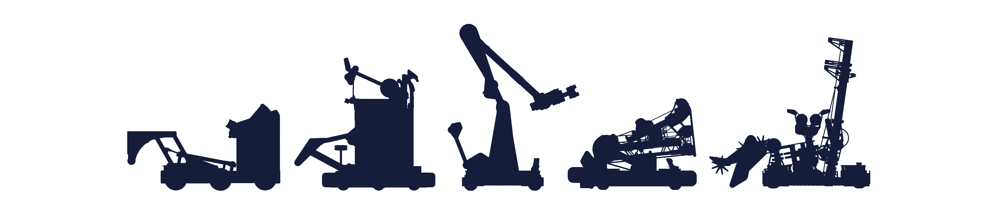

# ⭐️ Welcome to 6328's 10th season! ⭐️

FRC 6328 Mechanical Advantage is a FIRST Robotics Competition (FRC) Team based in Littleton, Massachusetts. We are a high school competitive robotics team participating in [FIRST](https://www.firstinspires.org) programs designed to teach students hands-on, real-world engineering and business skills. As a member of the Open Alliance, we strive to raise the tide for all by sharing our work on Chief Delphi and here on GitHub. Our build blogs can be found here: [2026](https://www.chiefdelphi.com/t/frc-6328-mechanical-advantage-2026-build-thread/509595), [2025](https://www.chiefdelphi.com/t/frc-6328-mechanical-advantage-2025-build-thread/477314), [2024](https://www.chiefdelphi.com/t/frc-6328-mechanical-advantage-2024-build-thread/442736), [2023](https://www.chiefdelphi.com/t/frc-6328-mechanical-advantage-2023-build-thread/420691), [2022](https://www.chiefdelphi.com/t/frc-6328-mechanical-advantage-2022-build-thread/398645), [2020/2021](https://www.chiefdelphi.com/t/frc-6328-mechanical-advantage-2020-2021-build-thread/370409).

The team was established in June 2016 as a 501(c)3 non-profit organization, Littleton STEM Educational Foundation (“Littleton Robotics”), whose mission is to promote FIRST and STEM education opportunities in Littleton, MA and other area towns. We are a community-based team and open to students regardless of their town of residence. For more information, please visit [team6328.org](https://www.team6328.org).

<picture>
  <source media="(prefers-color-scheme: dark)" srcset="robots-dark.png">
  <source media="(prefers-color-scheme: light)" srcset="robots-light.png">
  
</picture>
